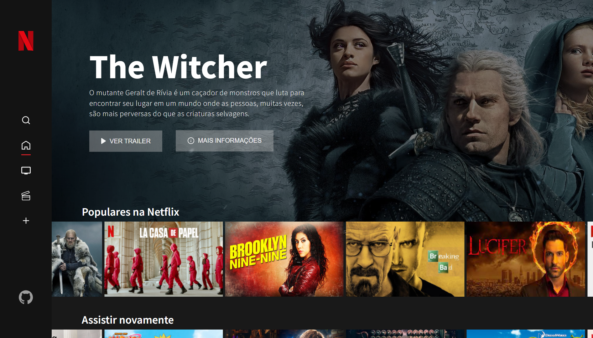

 
  

 

## :dart: Sobre ##

O site foi realizado na proposta de um projeto do bootcamp na Digital Innovation One. O objetivo foi recriar a interface do Netflix, adicionando novas funcionalidades e a criatividade.

Foi implementado na página inicial um carousel e informações nos cards. Duas páginas com as divisões entre filme e série, uma para pesquisar por titulo e gênero, e outra com a listagem dos conteúdos adicionados em "Minha lista", onde você pode adicionar na tela de detalhes.

## :rocket: Tecnologias ##

A seguintes ferramentas e tecnologias foram utilizadas nesse projeto:

- JavaScript
- JQuery
- HTML5
- CSS3

&#xa0;

 
Feito com :heart: por <a href="https://github.com/Davirichard" target="_blank">David Richard</a>

&#xa0;

<a href="#top">Ir para o topo</a>
